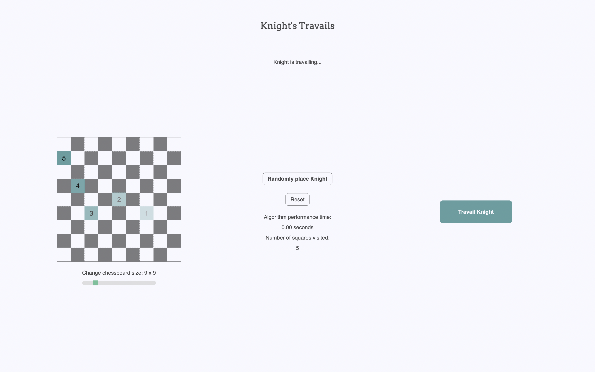

# knights-travails

Finds the shortest possible route for a knight to move from one square to another on a chessboard of variable size N, and returns the Knights path.

  - **Knight's Travails** - this problem is specifically about finding the shortest path within an unweighted graph. After much reading, my approach was actually relatively simple in the end: set up a 2-D array to keep track of the board, create ChessSquare nodes for the starting and ending [x, y] coordinates, initialize a queue and fill it with the starting ChessSquare node, then run the main loop - while the queue is not empty push every `possibleMoves()` for each ChessSquare into the queue with an incremented distance of +1 (removing duplicate values and moves with coords outside the board edges along the way). When the current ChessSquare node in the queue matches the ending [x, y] coordinates, the function will return the length of the path as well as the path coordinates (obtained by backtracing the path from the destination to the origin after completing a travail).

